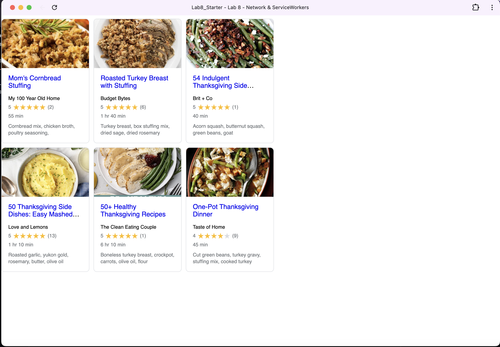

# Lab8-Starter

### [Link to Github Pages](https://katew-23.github.io/Lab8_Starter/)

#### Graceful Degradation and Service Workers:
- Service workers are an implementation of graceful degradation principles in web applications. As explained in the lab, graceful degradation starts with maximum technology and addresses lower levels with grace. With service workers, we start with the full-featured online experience where users get fresh recipe data from network requests, but gracefully degrade when network capacity fails or becomes slow (especially important for mobile devices with expensive and slower network capacity). Instead of our recipe app completely breaking without internet, it gracefully degrades to serve cached recipe data, maintaining functionality while acknowledging the constraint that "network capacity is not something we can control as developers."

#### PWA Screenshot:

